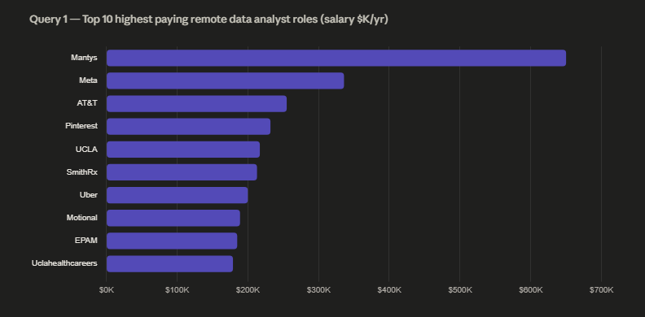
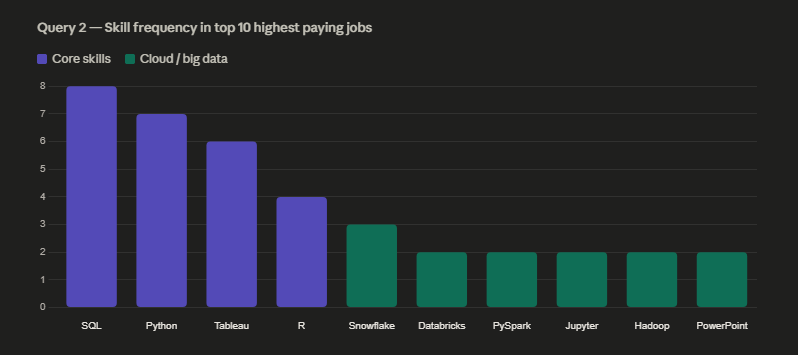
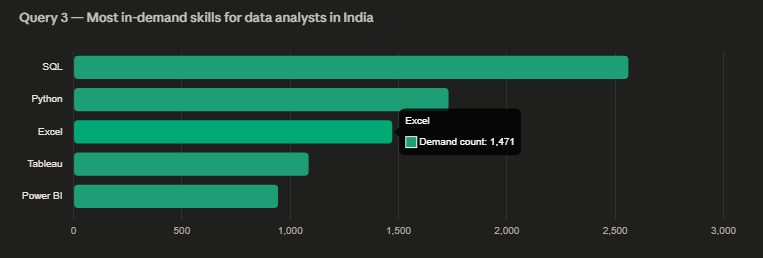
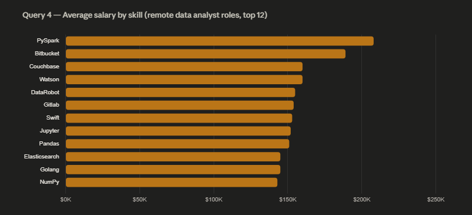
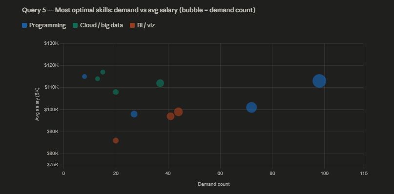

# 📊 Data Analyst Job Market Analysis (SQL Project)

## Introduction

This project explores the data analyst job market using SQL to answer key career questions: Which roles pay the most? What skills do employers demand? And which skills offer the best combination of high salary and high demand?

The analysis focuses specifically on **Data Analyst** roles — including remote positions and jobs based in India — to deliver actionable insights for job seekers looking to maximize their career potential.

---

## Background

The data analyst job market is competitive and rapidly evolving. Skills that were once sufficient — like Excel and basic SQL — are no longer enough for top-paying roles. Companies now value analysts who can work with large-scale data systems, cloud platforms, and modern visualization tools.

This project was built to answer five core questions:

1. What are the top-paying Data Analyst jobs?
2. What skills are required for those top-paying jobs?
3. What skills are most in demand for Data Analysts?
4. Which skills are associated with higher salaries?
5. What are the most optimal skills to learn (high demand + high pay)?

The dataset includes job postings from across the globe, with details on salaries, required skills, companies, and work arrangements.

---

## Tools I Used

| Tool | Purpose |
|------|---------|
| **PostgreSQL** | Database engine used to store and query job postings data |
| **pgAdmin** | GUI for managing the database and running queries |
| **SQL** | Core language for all analysis — JOINs, CTEs, aggregations, filtering |
| **VS Code** | Writing and organizing SQL query files |
| **Git & GitHub** | Version control and project sharing |

---

## The Analysis

The project is structured across five SQL queries, each targeting a specific question.

### 1. Top Paying Data Analyst Jobs
**File:** `1_top_paying_jobs.sql`

Retrieves the top 10 highest-paying remote Data Analyst roles. Filters for jobs where `job_location = 'Anywhere'` and `salary_year_avg IS NOT NULL`, then orders by salary descending.

```sql
SELECT job_id, job_title, salary_year_avg, name AS company_name
FROM job_postings_fact
LEFT JOIN company_dim ON job_postings_fact.company_id = company_dim.company_id
WHERE job_title_short = 'Data Analyst'
  AND job_location = 'Anywhere'
  AND salary_year_avg IS NOT NULL
ORDER BY salary_year_avg DESC
LIMIT 10;
```

---

### 2. Skills for Top Paying Jobs
**File:** `2_top_paying_jobs_skill.sql`

Uses a CTE to first identify the top 10 highest-paying roles, then joins with skill tables to reveal what skills those jobs require.

**Key findings:**
- **SQL** — appeared in 8 of the top 10 roles
- **Python** — appeared in 7 roles
- **Tableau** — appeared in 6 roles
- **R, Snowflake, Databricks, PySpark** — appeared in premium salary roles

---

### 3. Most In-Demand Skills
**File:** `3_top_demanding_skills`

Counts how many job postings require each skill for Data Analyst roles in India. Helps identify what employers are actively looking for in the local market.

```sql
SELECT skills, COUNT(skills_job_dim.job_id) AS demand_count
FROM job_postings_fact
INNER JOIN skills_job_dim ON job_postings_fact.job_id = skills_job_dim.job_id
INNER JOIN skills_dim ON skills_job_dim.skill_id = skills_dim.skill_id
WHERE job_title_short = 'Data Analyst' AND job_location = 'India'
GROUP BY skills
ORDER BY demand_count DESC
LIMIT 5;
```

---

### 4. Top Paying Skills
**File:** `4_top_paying_skills.sql`

Calculates the average salary associated with each skill across all remote Data Analyst positions. Reveals which skills command a salary premium.

**Top salary-associated skills:**
- Big data & cloud tools: **PySpark, Databricks, Hadoop**
- Notebooks & reporting: **Jupyter, PowerPoint**
- Core stack: **Python, SQL, Tableau**

---

### 5. Most Optimal Skills (High Demand + High Pay)
**File:** `5_most_optimal_skill.sql`

Uses two CTEs — one for demand count, one for average salary — then joins them to identify skills that are both frequently requested and well-compensated. Filters for skills with more than 10 job postings to ensure statistical relevance.

```sql
WITH skills_demand AS (...),
     average_salary AS (...)
SELECT skills_demand.skills, demand_count, avg_salary
FROM skills_demand
INNER JOIN average_salary ON skills_demand.skill_id = average_salary.skill_id
WHERE demand_count > 10
ORDER BY avg_salary DESC, demand_count DESC
LIMIT 25;
```

---

## Results & Visualizations

### Query 1 — Top 10 highest paying remote Data Analyst roles


| Rank | Company | Avg Yearly Salary |
|------|---------|-------------------|
| 1 | Mantys | $650,000 |
| 2 | Meta | $336,500 |
| 3 | AT&T | $255,830 |
| 4 | Pinterest | $232,423 |
| 5 | UCLA Health | $217,000 |
| 6 | SmithRx | $213,000 |
| 7 | Uber | $200,000 |
| 8 | Motional | $189,309 |
| 9 | EPAM Systems | $185,000 |
| 10 | UCLA Health Careers | $179,000 |

> The salary range is wide — from $179K to $650K — showing that seniority, specialization, and company size significantly impact compensation.

---

### Query 2 — Skills required in top 10 highest paying jobs


| Skill | Appearances | Category |
|-------|-------------|----------|
| SQL | 8 | Core |
| Python | 7 | Core |
| Tableau | 6 | Core |
| R | 4 | Core |
| Snowflake | 3 | Cloud |
| PySpark | 2 | Big Data |
| Databricks | 2 | Big Data |
| Jupyter | 2 | Big Data |
| Hadoop | 2 | Big Data |
| PowerPoint | 2 | Reporting |

> SQL, Python, and Tableau dominate. Cloud and big data tools appear less often but in the very highest-paying roles.

---

### Query 3 — Most in-demand skills for Data Analysts in India


| Rank | Skill | Demand Count |
|------|-------|--------------|
| 1 | SQL | 2,561 |
| 2 | Python | 1,731 |
| 3 | Excel | 1,471 |
| 4 | Tableau | 1,085 |
| 5 | Power BI | 944 |

> SQL is the undisputed #1 skill in the Indian job market. Excel still holds strong at #3, showing that foundational tools remain critical locally.

---

### Query 4 — Top paying skills (remote roles, avg salary)


| Rank | Skill | Avg Yearly Salary |
|------|-------|-------------------|
| 1 | PySpark | $208,172 |
| 2 | Bitbucket | $189,155 |
| 3 | Couchbase | $160,515 |
| 4 | Watson | $160,515 |
| 5 | DataRobot | $155,486 |
| 6 | GitLab | $154,500 |
| 7 | Swift | $153,750 |
| 8 | Jupyter | $152,777 |
| 9 | Pandas | $151,821 |
| 10 | Elasticsearch | $145,000 |
| 11 | Golang | $145,000 |
| 12 | NumPy | $143,513 |

> Niche big data and DevOps-adjacent skills like PySpark, Bitbucket, and Couchbase command the highest salaries — often because few analysts have them.

---

### Query 5 — Most optimal skills (high demand + high pay)


| Skill | Demand Count | Avg Salary | Category |
|-------|-------------|------------|----------|
| Go | 27 | $115,320 | Programming |
| BigQuery | 13 | $109,654 | Cloud |
| Snowflake | 37 | $112,948 | Cloud |
| Python | 236 | $101,397 | Programming |
| SQL | 398 | $97,237 | Programming |
| Tableau | 230 | $99,288 | BI / Viz |
| Azure | 34 | $105,400 | Cloud |
| AWS | 32 | $106,440 | Cloud |
| R | 148 | $100,499 | Programming |
| Power BI | 110 | $97,431 | BI / Viz |

> The sweet spot: SQL and Python offer massive demand with solid salaries. Cloud tools (Snowflake, AWS, Azure, BigQuery) offer higher pay with moderate demand — excellent for differentiation.

---

## What I Learned

- **CTEs make complex queries readable** — Breaking multi-step analysis into named CTEs (`WITH` clauses) keeps logic clean and debuggable.
- **JOINs are the backbone of relational analysis** — Combining `job_postings_fact`, `company_dim`, `skills_job_dim`, and `skills_dim` across queries gave a complete picture of the job market.
- **Aggregations reveal patterns** — `COUNT()` and `AVG()` on grouped data turned raw rows into meaningful market insights.
- **Filtering matters** — Small changes like adding `job_work_from_home = True` or `salary_year_avg IS NOT NULL` significantly shaped the results and their relevance.
- **SQL alone can drive real insights** — No Python or BI tool was needed to extract meaningful, career-relevant conclusions from a large dataset.

---

## Conclusion

The analysis points to a clear strategy for Data Analysts looking to maximize their career potential:

- **SQL, Python, and Tableau** form the essential foundation — they appear most frequently across high-paying and high-demand roles.
- **Cloud and big data tools** like Snowflake, Databricks, and PySpark are becoming premium differentiators — rare enough to command higher salaries, but growing in demand.
- **The most optimal skills to invest in** are those that sit at the intersection of high demand and strong pay — not just the highest-paying (which may be niche) or the most common (which may be commoditized).

For anyone entering or growing in the data field, this analysis suggests going beyond basic analytics skills and investing in the modern data stack.

---

## Database Schema

```
company_dim         →  company_id (PK), name, link
skills_dim          →  skill_id (PK), skills, type
job_postings_fact   →  job_id (PK), company_id (FK), salary_year_avg, ...
skills_job_dim      →  job_id (FK) + skill_id (FK) [composite PK]
```